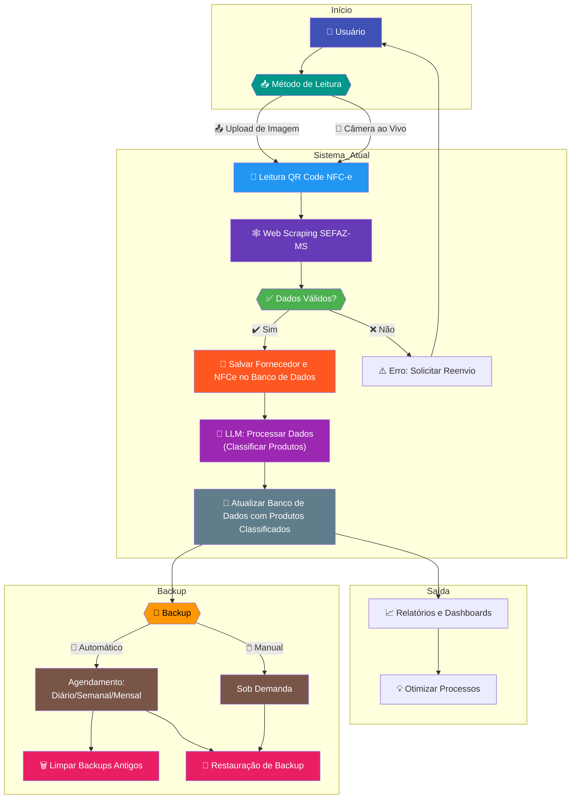

# Gestão Simples - Sistema de Gestão para Pequenas Empresas

[](https://opensource.org/licenses/MIT)
[](https://www.python.org/downloads/)
[](https://streamlit.io/)

Sistema de gestão simplificado para pequenas empresas que automatiza a leitura de cupons via QR Code, coleta dados da SEFAZ-MS e armazena informações de forma segura em banco de dados MySQL.


## 🎯 O Problema

Pequenas empresas, especialmente no setor de alimentação, enfrentam diversos desafios ao cadastrar produtos adquiridos de supermercados e fornecedores:

### 1. Falta de padronização nas informações dos fornecedores

- Produtos podem ser nomeados de forma diferente em notas fiscais (ex.: "Tomate Salada" vs. "Tomate Vermelho").
- Fornecedores usam medidas distintas (kg, unidades, pacotes), dificultando a conversão para sistemas internos.
- Produtos comprados em supermercados muitas vezes não têm identificadores padronizados, exigindo cadastro manual.

### 2. Processos manuais e propensos a erros

- A falta de automação leva a erros de digitação, duplicidade ou omissão de dados.
- Equipes pequenas **perdem horas registrando produtos**, desviando o foco de atividades essenciais como atendimento ao cliente.

### 3. Custos ocultos e margens de lucro

- Erros no cadastro de preços ou quantidades distorcem o cálculo do custo por porção, impactando a precificação.
- Falhas no registro de estoque levam a compras excessivas ou falta de ingredientes, gerando perdas.

### 4. Rotatividade de pessoal

- Funcionários temporários ou mal treinados cometem erros no cadastro, especialmente em períodos de alta demanda.
- A ausência de padrões claros leva a inconsistências entre diferentes colaboradores.

## 💡 Nossa Solução

O Gestão Simples é um sistema de gestão inteligente que transforma notas fiscais em dados precisos em segundos.

### 🛠️ Como Funciona

1. **📸 Escaneie o QR Code da NFC-e** (por upload de imagem ou câmera ao vivo).  
2. **🤖 Dados são padronizados automaticamente** (nomes, preços, unidades de medida).  
3. **📊 Estoque, custos e fornecedores atualizados em tempo real** no seu dashboard.  



### 🚀 Funcionalidades já implementadas

#### 📲 Leitura instantânea de NFC-e via QR Code

- Por upload de imagem
- Por captura em tempo real (câmera ao vivo)

#### 🤖 Coleta automática de dados da SEFAZ-MS através de *web scraping*

#### 🗄️ Armazenamento seguro em banco de dados MySQL

#### ⚙️ Configuração simplificada e automatizada de banco de dados

#### 💾 Sistema de Backup de Banco de Dados

- Backup manual sob demanda
- **Backup automático** com agendamento configurável
- Opções de **restauração de backups**
- Gerenciamento de remoção de backups antigos

#### 📝 Gestão Manual de Dados

- Inserção manual de registros
- Edição de dados existentes
- Remoção de registros

### 🏗️ Funcionalidades em Desenvolvimento

Estamos desenvolvendo um modulo de sistema automatizado para **padronizar e classificar produtos de fornecedores** utilizando *Large Language Models (LLMs)*, com o objetivo de otimizar a criação de **fichas técnicas**, **relatórios operacionais** e **dashboards de estoque e preços**.  

1. **Classificação Inteligente de Produtos com LLMs**  
   - **Desafio Atual:** Descrições inconsistentes de produtos entre fornecedores (ex.: "Tomate Salada GRAMAS" vs. "Tomate 1kg").  
   - **Solução:** Um modelo de LLM será treinado para identificar e padronizar produtos em **categorias genéricas** (ex.: "Tomate - 1kg"), permitindo comparações precisas entre fornecedores.  

2. **Fichas Técnicas Automatizadas**  
   - Geração automática de fichas técnicas padronizadas, incluindo informações como:  
     - **Ingredientes base** (para cálculos de receitas).  
     - **Custos unitários** e por porção.

3. **Integração com Dashboards de Gestão**  
   - Visualização em tempo real de:  
     - **Estoque crítico** (alertas para reabastecimento).  
     - **Variação de preços** entre fornecedores.  
     - **Custos operacionais** por produto/prato.  

4. **Relatórios de Eficiência**  
   - Análises comparativas de custo-benefício entre produtos similares.  
   - Histórico de preços e tendências sazonais.  

#### 📌 Benefícios Esperados

- ✅ **Redução de custos**: Comparação instantânea de preços entre fornecedores.  
- ✅ **Economia de tempo**: Eliminação da classificação manual de produtos.  
- ✅ **Precisão operacional**: Dados padronizados para tomada de decisão estratégica.  
- ✅ **Escalabilidade**: Adaptável a novos fornecedores e categorias de produtos.  

#### 🗺️ Roadmap Futuro

- Recomendação de fornecedores com base em custo, qualidade e histórico.  
- Uso de séries temporais para evitar desperdícios.  

## 🚀 Instalação

### 📋 Pré-requisitos

Antes de começar, verifique se você possui

- ✅ Python 3.11 ou superior instalado
- ✅ Git instalado na sua máquina
- ✅ Servidor MySQL em execução
- ✅ Poetry instalado (gerenciador de dependências)

**Siga estes passos para configurar o projeto:**

#### 1. Clonar o repositório

  ```bash
  git clone https://github.com/WolkerDias/gestao-simples.git
  cd gestao-simples
  ```

#### 2. Configurar Ambiente Virtual

Recomendamos o uso do Poetry para gerenciamento de dependências:

  ```bash
  # Instalar Poetry (caso não tenha)
  pip install poetry

  # Instalar dependências do projeto
  poetry install
  ```

#### 3. Configurar Banco de Dados

Antes de iniciar o projeto, configure suas credenciais de banco de dados:

- Crie o banco de dados MySQL correspondente:

  ```sql
  CREATE DATABASE db_gestao;
  ```

- Edite o arquivo `config/settings.py`
- Preencha com suas credenciais MySQL:

  ```python
  DB_CONFIG = {
    'user': 'root',             # 👤 Seu usuário
    'password': 'senha_segura', # 🔑 Sua senha
    'host': 'localhost',        # 🌐 Servidor MySQL
    'database': 'db_gestao'     # 🗃️ Nome do banco
  }
  ```

## 🚦 Iniciando o Sistema

```bash
# Ativar ambiente virtual
poetry env activate

# Iniciar aplicação
streamlit run app.py
```

Acesse no navegador: 🌐 <http://localhost:8501>

## 🗂️ Estrutura do Projeto

```bash
gestao-simples/
├──📂 config/
│  ├──📜 database.py   # Conexão com MySQL
│  └──📜 settings.py   # Configurações do sistema
├──📂 models/          # Modelos de dados
├──📂 repositories/    # Camada de repositórios
├──📂 services/        # Lógica de negócio
├──📂 utils/           # Utilitários
├──📂 views/           # Interfaces
├──📜 app.py           # Aplicação principal
├──📜 pyproject.toml   # Configuração do Poetry
└──📜 README.md        # Este arquivo
```

### 📝 Observações Importantes

- Diretórios com `.` (`.backups`, `.capturas`, `.logs`) são criados automaticamente ao executar o projeto
- Os diretórios `__pycache__` são gerados pelo Python para cache de módulos compilados

## 🆘 Problemas comuns

### Erro de conexão com MySQL

- Verifique se o servidor está online
- Confira usuário/senha no `settings.py`
- Garanta privilégios de acesso ao banco

### Dependências não instaladas

  ```bash
  poetry install --sync
  ```

## 🤝 Como Contribuir

1. Faça um Fork do projeto

2. Crie sua branch:

    ```bash
    git checkout -b minha-feature
    ```

3. Commit suas alterações:

    ```bash
    git commit -m 'Adicionei uma nova feature'
    ```

4. Envie para o repositório:

    ```bash
    git push origin minha-feature
    ```

5. Abra um Pull Request

## 📄 Licença

Distribuído sob licença MIT. Consulte o arquivo [LICENSE](LICENSE) para detalhes.

**Contato do desenvolvedor:**  

[](mailto:wolker.sd@hotmail.com)
[](https://www.linkedin.com/in/wolkerdias)
